# 🐾 MaxiMar Pet Store

**Sistema de E-commerce para Tienda de Mascotas**

Proyecto integrador de Programación III - UTN Avellaneda
Desarrollado por: **Marcelo Aquino** y **Maximiliano Arcieri**

---

## 📋 Descripción

MaxiMar Pet Store es un sistema completo de e-commerce diseñado específicamente para tiendas de mascotas. Permite la gestión integral de productos, ventas y administradores a través de una interfaz web moderna y responsive.

## ✨ Características Principales

- 🛒 **Carrito de Compras**: Sistema completo con persistencia de datos
- 👨‍💼 **Panel de Administración**: Gestión de productos, ventas y usuarios
- 🔐 **Sistema de Autenticación**: JWT para administradores con roles
- 📱 **Responsive Design**: Compatible con dispositivos móviles y desktop
- 🎨 **Modo Oscuro/Claro**: Interfaz adaptable
- 📦 **Gestión de Stock**: Control de inventario
- 📊 **Reportes de Ventas**: Visualización y análisis de ventas

---

## 🚀 Instalación y Configuración

### Pre-requisitos

- **Node.js** (v14 o superior)
- **MySQL** (v8.0 o superior)
- **npm** o **yarn**

### 1. Clonar el Repositorio

```bash
git clone https://github.com/MarceAquino/MaxiMar.git
cd MaxiMar-Pet-Store
```

### 2. Configuración del Backend

```bash
cd back-end
npm install
```

#### Crear archivo `.env` en `/back-end/`:

```env
# Base de datos
DB_HOST=localhost
DB_PORT=3306
DB_NAME=maximar_pet_store
DB_USER=usuario_mysql
DB_PASSWORD=contraseña_mysql

# Servidor
PORT=3030
NODE_ENV=development

# JWT
JWT_SECRET=tu_clave_secreta_super_segura
JWT_EXPIRES_IN=24h
```

### 3. Configuración del Frontend

```bash
cd ../front-end
npm install
```

### 4. Configuración de Base de Datos

1. **Crear la base de datos MySQL:**

```sql
CREATE DATABASE maximar_pet_store;
```

2. **Las tablas se crean automáticamente** al iniciar el servidor (Sequelize sync)

### 5. Iniciar la Aplicación

#### Servidor Backend:

```bash
cd back-end
npm start
# Servidor ejecutándose en http://localhost:3030
```

#### Servidor Frontend:

```bash
cd front-end
npm start
# Cliente ejecutándose en http://localhost:8080
```

### 6. Seeder de Superadmin

Para crear un usuario superadmin inicial:

```bash
node back-end/seeder/superadminSeeder.js
```

**Credenciales por defecto:**
- **Email:** superadmin@maximar.com
- **Contraseña:** SuperAdmin123!

---
### 🛒 Interfaz de Cliente

#### 🔐 Login de Cliente  
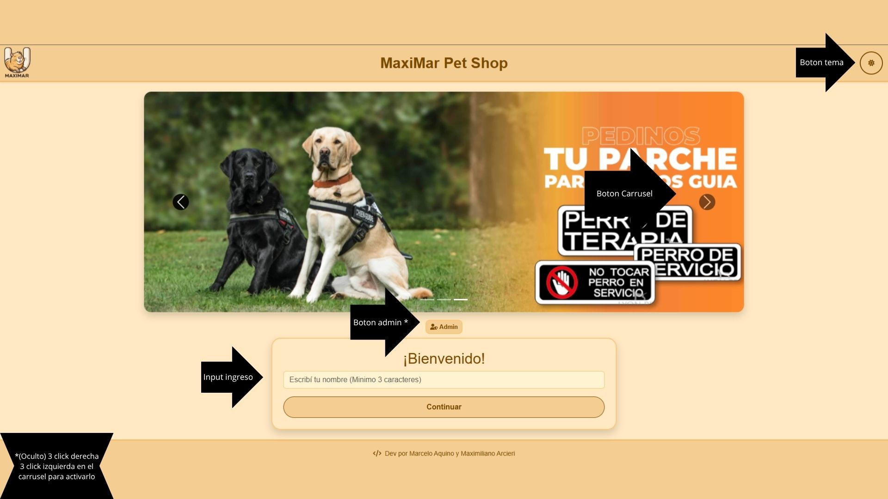

#### 🧾 Catálogo de Productos  
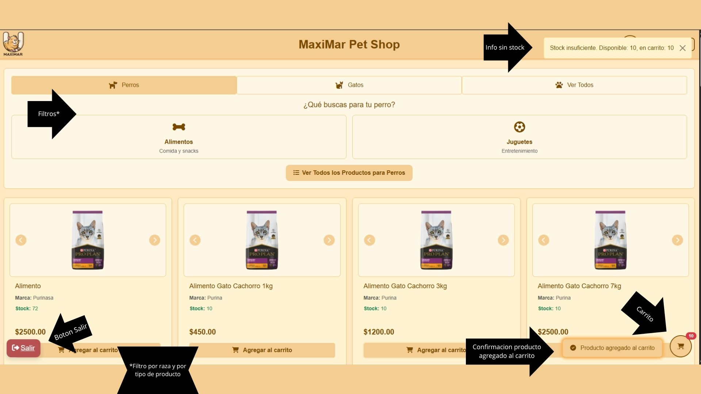

#### 🛍️ Carrito de Compras  
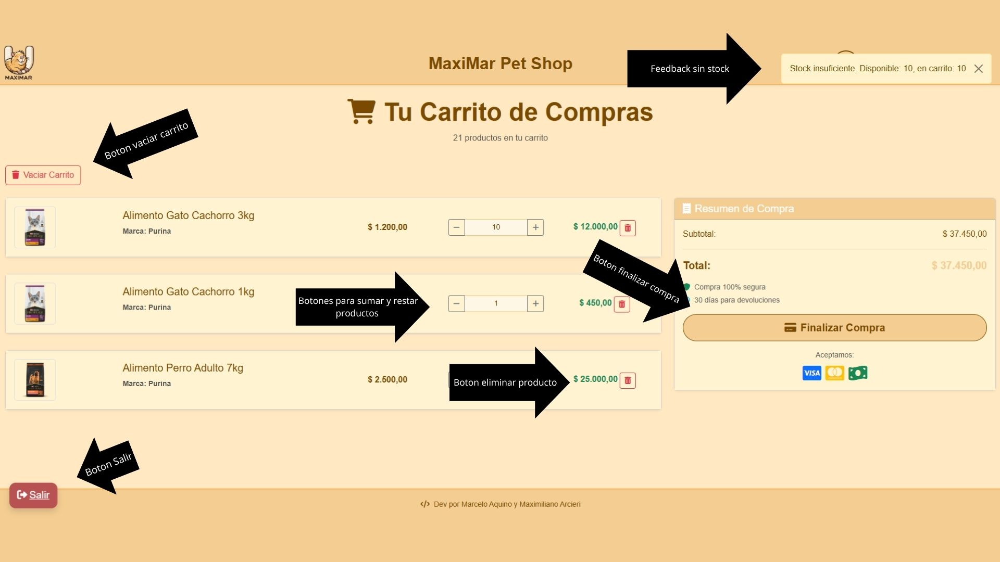

#### 🧾 Ticket de Compra  
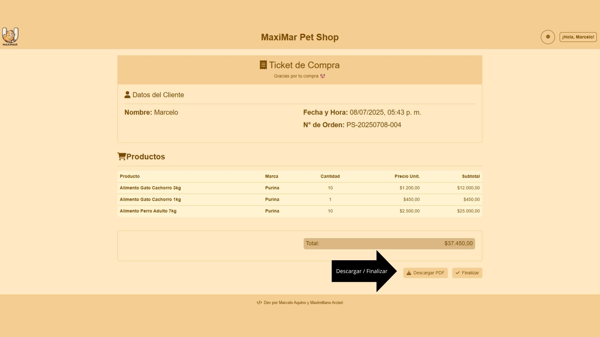

---

### 👨‍💼 Panel de Administración

#### 🔐 Login de Administrador  
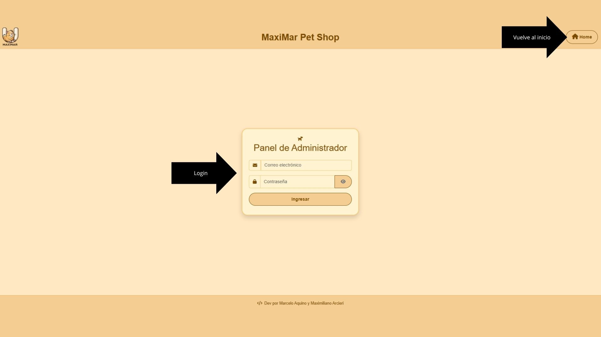

#### 📊 Dashboard Principal  
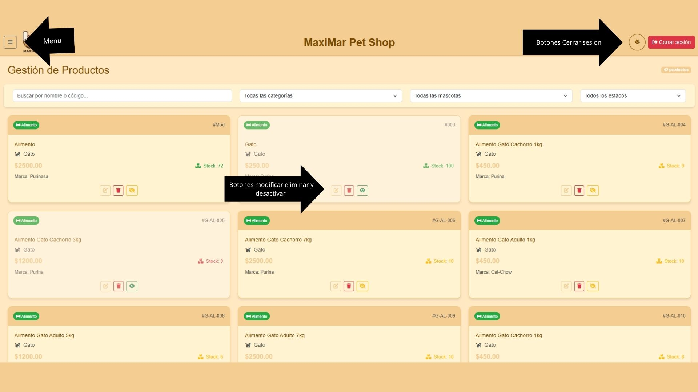

#### 📋 Menú del Dashboard  
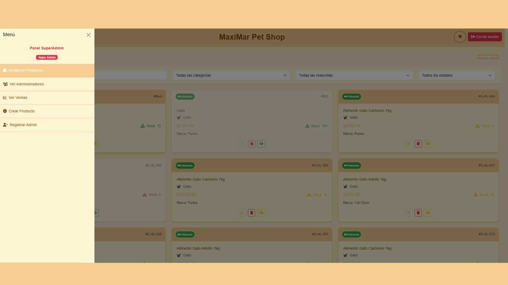

#### 👥 Gestión de Administradores  
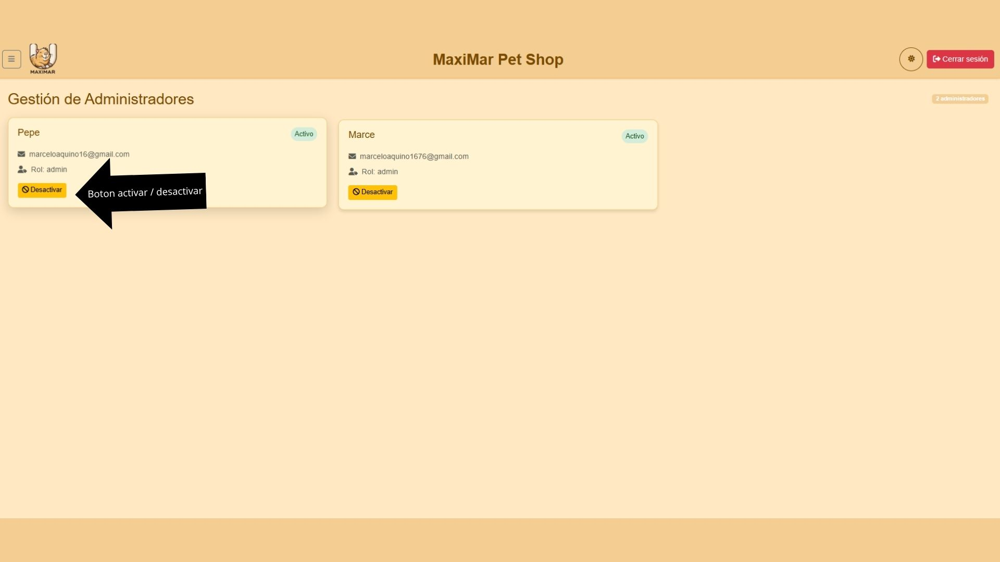

#### 🧾 Historial de Ventas  
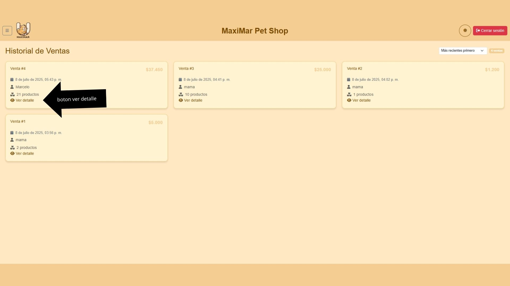

#### ➕ Crear Producto  
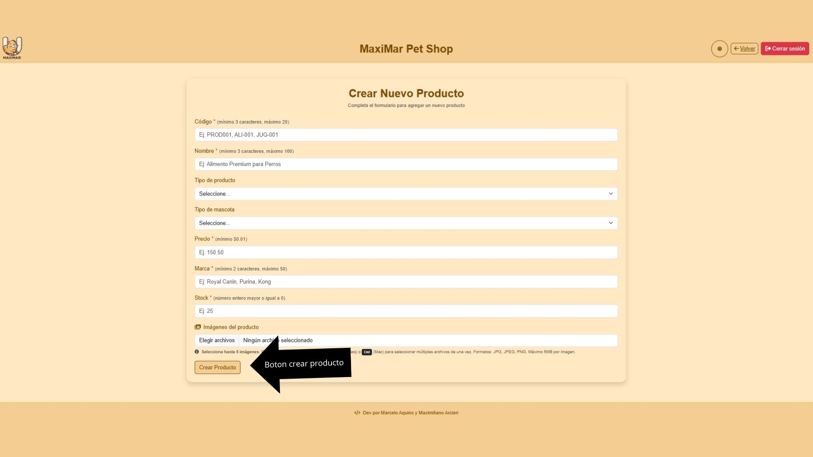

#### 🧑‍💼 Registrar Administrador  
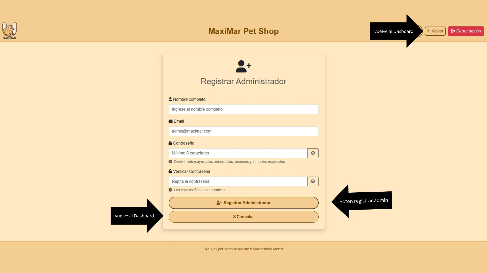

#### ✏️ Modificar Producto  
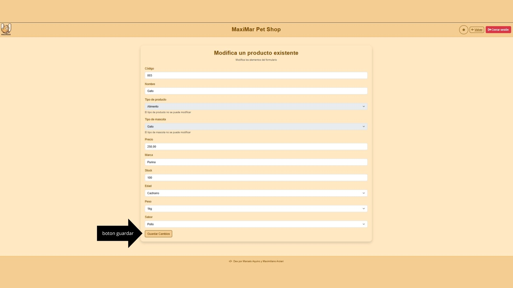

---

## 🏗️ Arquitectura del Sistema

### Frontend
- **HTML5, CSS3, JavaScript (ES6+)**
- **Bootstrap 5** para diseño responsive
- **Font Awesome** para iconografía
- **Módulos ES6** para organización del código
- **Local/Session Storage** para persistencia local

### Backend
- **Node.js** con **Express.js**
- **MySQL** como base de datos
- **Sequelize ORM** para manejo de datos
- **JWT** para autenticación
- **Bcrypt** para encriptación de contraseñas
- **Multer** para manejo de archivos
- **CORS** habilitado para peticiones cross-origin

---

## 📊 Base de Datos

### Entidades Principales

#### 🗄️ Administradores (Admin)
```sql
- admin_id (PK, AUTO_INCREMENT)
- email (UNIQUE, NOT NULL)
- nombre (NOT NULL)
- password (HASHED, NOT NULL)
- rol (admin|superadmin)
- activo (BOOLEAN, DEFAULT true)
```

#### 📦 Productos (Producto)
```sql
- producto_id (PK, AUTO_INCREMENT)
- codigo (UNIQUE, NOT NULL)
- nombre (NOT NULL)
- categoria (alimento|juguete)
- tipo_mascota (perro|gato)
- precio (DECIMAL, NOT NULL)
- marca (NOT NULL)
- urls (JSON - Array de imágenes)
- stock (INTEGER, DEFAULT 0)
- atributos_especificos (JSON)
- activo (BOOLEAN, DEFAULT true)
```

#### 🧾 Ventas (Venta)
```sql
- venta_id (PK, AUTO_INCREMENT)
- cliente (VARCHAR, DEFAULT 'Cliente Anónimo')
- subtotal (DECIMAL, NOT NULL)
- total (DECIMAL, NOT NULL)
- createdAt (TIMESTAMP)
```

#### 📋 Detalle de Ventas (DetalleVenta)
```sql
- detalle_id (PK, AUTO_INCREMENT)
- venta_id (FK → Venta)
- producto_id (FK → Producto)
- cantidad (INTEGER, NOT NULL)
- precio_unitario (DECIMAL, NOT NULL)
- subtotal (DECIMAL, NOT NULL)
```

### 🔗 Relaciones
- Una **Venta** tiene muchos **DetalleVenta**
- Un **Producto** puede estar en muchos **DetalleVenta**
- **DetalleVenta** pertenece a **Venta** y **Producto**

---

## 👤 Sistema de Roles

### 🔑 SuperAdmin
- ✅ Gestión completa de productos (CRUD)
- ✅ Activar/desactivar productos
- ✅ Registrar nuevos administradores
- ✅ Gestionar estado de administradores
- ✅ Ver todas las ventas y reportes
- ✅ Eliminar productos permanentemente

### 👨‍💼 Admin
- ✅ Crear y editar productos
- ❌ No puede activar/desactivar productos
- ❌ No puede registrar administradores
- ❌ No puede ver ventas
- ❌ No puede eliminar productos

### 🛒 Cliente (Sin autenticación)
- ✅ Ver catálogo de productos
- ✅ Agregar productos al carrito
- ✅ Realizar compras
- ✅ Ver detalles de productos

---

## 🕵️ Acceso al Panel de Administración

El acceso al panel de administración está oculto mediante un "truco secreto":

1. Dirígete al carrusel de imágenes de la página de inicio
2. Haz clic 3 veces seguidas en la flecha derecha del carrusel
3. Luego haz clic 3 veces seguidas en la flecha izquierda del carrusel
4. Aparecerá un botón especial de acceso admin con animación
5. Haz clic en ese botón para acceder al login de administrador

**Secuencia:** → → → ← ← ←

---

## 🎯 Funcionalidades Detalladas

### 🛒 Para Clientes

#### Catálogo de Productos
- Visualización con imágenes, precios y detalles
- Filtros por categoría (alimento/juguete) y tipo de mascota (perro/gato)
- Paginación y ordenamiento de resultados

#### Carrito de Compras
- Agregar/quitar productos con validación de stock
- Persistencia en `sessionStorage`
- Cálculo automático de totales
- Validación de disponibilidad antes de compra

#### Proceso de Compra
- Checkout sencillo con datos del cliente
- Generación automática de número de orden
- Descuento automático de stock
- Ticket de compra descargable/imprimible

### 👨‍💼 Para Administradores

#### Gestión de Productos
- CRUD completo de productos
- Carga múltiple de imágenes (hasta 5 por producto)
- Validación de datos y códigos únicos
- Control de stock y estado (activo/inactivo)
- Atributos específicos por tipo de producto

#### Dashboard Intuitivo
- Vista general con métricas importantes
- Filtros avanzados y búsqueda
- Interfaz responsiva y moderna
- Notificaciones en tiempo real

#### Sistema de Reportes (Solo SuperAdmin)
- Historial completo de ventas
- Detalles expandibles de cada transacción
- Estadísticas de productos más vendidos
- Filtros por fecha y cliente

---

## 🗂️ Estructura del Proyecto

```
MaxiMar-Pet-Store/
│
├── 📁 back-end/                    # Servidor Node.js
│   ├── 📄 server.js               # Punto de entrada del servidor
│   ├── 📄 package.json            # Dependencias del backend
│   ├── 📁 src/
│   │   ├── 📁 config/             # Configuración (DB, constantes)
│   │   ├── 📁 controllers/        # Lógica de negocio
│   │   │   ├── 📁 adminController/
│   │   │   ├── 📁 customerController/
│   │   │   ├── 📁 productoController/
│   │   │   └── 📁 ventaController/
│   │   ├── 📁 middlewares/        # Middlewares (auth, upload, etc.)
│   │   ├── 📁 models/             # Modelos Sequelize
│   │   ├── 📁 routers/            # Rutas de la API
│   │   └── 📁 utils/              # Funciones auxiliares
│   └── 📁 Diagrama entidad relacion/
│
├── 📁 front-end/                   # Cliente web
│   ├── 📄 index.html              # Página principal
│   ├── 📄 package.json            # Dependencias del frontend
│   ├── 📁 css/                    # Estilos CSS
│   ├── 📁 html/                   # Páginas HTML
│   │   ├── 📁 admin/              # Panel de administración
│   │   └── 📁 customer/           # Páginas de cliente
│   ├── 📁 img/                    # Imágenes y recursos
│   └── 📁 js/                     # JavaScript modular
│       ├── 📁 admin/              # Scripts del panel admin
│       ├── 📁 customer/           # Scripts del cliente
│       ├── 📁 config/             # Configuración de API
│       └── 📁 utils/              # Utilidades compartidas
│
└── 📄 README.md                   # Documentación del proyecto
```

---

## 🔧 Tecnologías y Dependencias

### Backend
```json
{
  "express": "^4.21.2",
  "sequelize": "^6.37.7",
  "mysql2": "^3.14.1",
  "jsonwebtoken": "^9.0.2",
  "bcrypt": "^6.0.0",
  "cors": "^2.8.5",
  "multer": "^2.0.1",
  "dotenv": "^16.5.0"
}
```

### Frontend CDN
- **Bootstrap 5.3.6**: Framework CSS
- **Font Awesome 6.0.0**: Iconografía
- **Google Fonts**: Tipografías personalizadas

---

## 🔒 Seguridad Implementada

### 🛡️ Autenticación y Autorización
- **JWT (JSON Web Tokens)** para sesiones seguras
- **Bcrypt** para hash de contraseñas (salt rounds: 12)
- **Middleware de autenticación** en rutas protegidas
- **Control de roles** (SuperAdmin/Admin)
- **Expiración automática** de tokens (24h)

### 🔐 Validaciones
- **Validación de tipos de datos** con Sequelize
- **Constraints de base de datos** (UNIQUE, NOT NULL)
- **Validación de stock** antes de ventas
- **Validación de permisos** por rol

### 🚪 Gestión de Sesiones
- **sessionStorage** para tokens
- **Limpieza automática** de datos al cerrar sesión
- **Eventos beforeunload** para limpieza en cierre forzoso
- **Verificación continua** de tokens válidos

---

## 📱 Responsive Design

### 🖥️ Desktop (1200px+)
- Dashboard completo con sidebar fijo
- Múltiples columnas para productos
- Tablas expandibles para datos detallados
- Formularios en modal o páginas dedicadas

### 📱 Mobile (320px - 767px)
- Menú hamburguesa
- Una columna para productos
- Botones más grandes para touch
- Interfaz simplificada y enfocada

---

## 🧪 Testing y Calidad de Código

### 📏 Estándares de Código
- **ESLint Standard** para JavaScript
- **Convenciones de nomenclatura** consistentes
- **Comentarios JSDoc** en funciones principales
- **Modularización** clara y separación de responsabilidades

### 🔍 Validaciones del Sistema
- **Validación de formularios** en tiempo real
- **Manejo de errores** con try-catch
- **Logging** detallado en consola
- **Feedback visual** para usuarios

---

## 🚀 Deployment y Producción

### 🌐 Configuración para Producción

**Variables de Entorno:**
```env
NODE_ENV=production
DB_HOST=tu_servidor_produccion
JWT_SECRET=clave_super_segura_de_produccion
```

**Monitoreo:**
- Logs estructurados
- Métricas de performance
- Monitoreo de errores
- Backups automáticos de BD

---

## 📚 Casos de Uso Principales

### 🛒 Flujo de Compra del Cliente
1. Cliente navega por el catálogo
2. Filtra productos por categoría/mascota
3. Agrega productos al carrito
4. Revisa el carrito y ajusta cantidades
5. Procede al checkout
6. Confirma la compra
7. Recibe número de orden y ticket

### 👨‍💼 Gestión de Productos (Admin)
1. Admin inicia sesión en el panel
2. Navega a gestión de productos
3. Crea producto
4. Activa/desactiva productos según stock

### 🔧 Administración del Sistema (SuperAdmin)
1. SuperAdmin accede al panel completo
2. Registra nuevos administradores
3. Gestiona estados de admins
4. Revisa reportes de ventas completos
5. Administra productos con permisos totales

---

## 👥 Equipo de Desarrollo

- 👨‍💻 **Marcelo Aquino**
- 👨‍💻 **Maximiliano Arcieri**

---

**Última actualización:** Julio 2025
**Versión del Sistema:** 1.0.0
**Estado:** ✅ Estable para Producción
